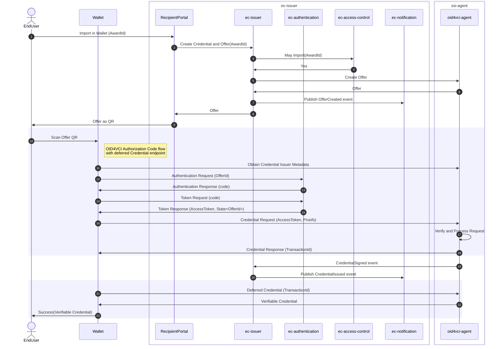

# Import in Wallet

Technical details for the [Import In Wallet Feature](./features.md#wallet).

In this diagram, the following actions take place:

1. *EndUser* requests to import award in wallet via *RecipientPortal*
1. *RecipientPortal* creates credential and offer for the award on *ec-issuer*
1. *ec-issuer* checks permission on *Access Control*
1. *Access Control* returns Yes when permission is allowed
1. *ec-issuer* creates offer on *oid4vci-agent*
1. *oid4vci-agent* returns offer to *ec-issuer*
1. *ec-issuer* publishes offer created event on *Notification Service*
1. *ec-issuer* returns offer to *RecipientPortal*
1. *RecipientPortal* presents offer as QR code to *EndUser*
1. *EndUser* scans QR code with *Wallet*
1. *Wallet* obtains credential issuer metadata from *oid4vci-agent*
1. *Wallet* sends authentication request to *ec-authentication*
1. *ec-authentication* returns code to *Wallet*
1. *Wallet* requests token with code from *ec-authentication*
1. *ec-authentication* returns access token and state to *Wallet*
1. *Wallet* sends credential request with access token and proofs to *oid4vci-agent*
1. *oid4vci-agent* verifies and processes the request
1. *oid4vci-agent* sends credential response with transaction ID to *Wallet*
1. *oid4vci-agent* sends CredentialSigned event to *ec-issuer*
1. *ec-issuer* publishes CredentialIssued event on *Notification Service*
1. *Wallet* requests deferred credential from *oid4vci-agent*
1. *oid4vci-agent* sends verifiable credential to *Wallet*
1. *Wallet* notifies *EndUser* of success with verifiable credential

[Diagram adapted from Backstage docs](https://backstage.sdp.surf.nl/docs/default/component/educredentials-service/educredentials_services_architecture/#sequence-diagrams-work-in-progress)
