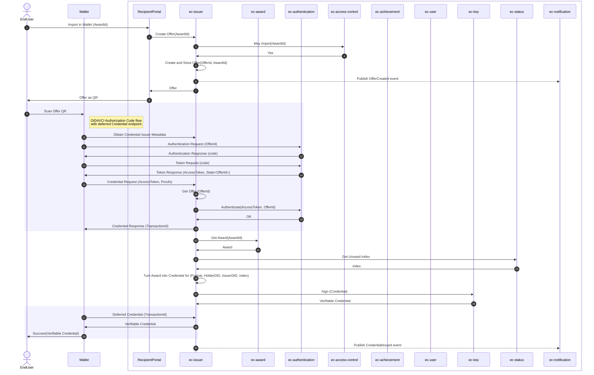

# Import in Wallet

Technical details for the [Import In Wallet Feature](./features.md#wallet).

In this diagram, the following actions take place:

1. *EndUser* requests to import award in wallet via *RecipientPortal*
1. *RecipientPortal* creates offer for the award on *Issuer*
1. *Issuer* checks permission on *Access Control*
1. *Access Control* returns Yes when permission is allowed
1. *Issuer* creates and stores the offer
1. *Issuer* publishes offer created event on *Notification Service*
1. *Issuer* returns offer to *RecipientPortal*
1. *RecipientPortal* presents offer as QR code to *EndUser*
1. *EndUser* scans QR code with *Wallet*
1. *Wallet* obtains credential issuer metadata from *ec-issuer*
1. *Wallet* sends authentication request to *ec-authentication*
1. *ec-authentication* returns code to *Wallet*
1. *Wallet* requests token with code from *ec-authentication*
1. *ec-authentication* returns access token and state to *Wallet*
1. *Wallet* sends credential request with access token and proofs to *ec-issuer*
1. *ec-issuer* retrieves offer from its storage
1. *ec-issuer* authenticates token and offer on *ec-authentication*
1. *ec-authentication* confirms authentication to *ec-issuer*
1. *ec-issuer* sends credential response with transaction ID to *Wallet*
1. *ec-issuer* requests award details from *ec-award*
1. *ec-award* returns award to *ec-issuer*
1. *ec-issuer* gets unused index from *ec-status*
1. *ec-status* returns index to *ec-issuer*
1. *ec-issuer* converts award to credential
1. *ec-issuer* requests signature from *ec-key*
1. *ec-key* returns signed verifiable credential to *ec-issuer*
1. *Wallet* requests deferred credential from *ec-issuer*
1. *ec-issuer* sends verifiable credential to *Wallet*
1. *Wallet* notifies *EndUser* of success with verifiable credential
1. *ec-issuer* publishes credential issued event on *Notification Service*

[Diagram taken from Backstage docs](https://backstage.sdp.surf.nl/docs/default/component/educredentials-service/educredentials_services_architecture/#sequence-diagrams-work-in-progress)
